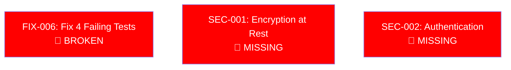
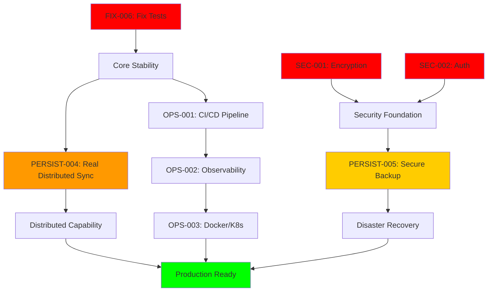
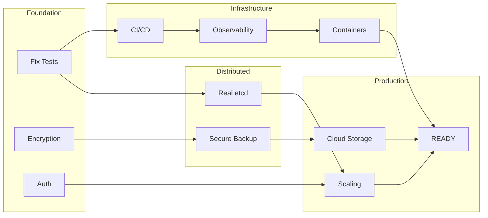

# 🗺️ Task Dependency Graph - Critical Path Analysis

## 🚨 Executive Summary
**The project has critical dependency violations. Features were built on broken foundations.**

## 🔴 P0 BLOCKERS - Must Fix First (No Dependencies)



**These have NO dependencies and BLOCK everything else.**

## 🔥 Critical Path to Production



## 📊 Detailed Dependency Matrix

### 🔴 P0 - No Dependencies (Can Start Immediately)

| Task | Depends On | Blocks | Critical Path |
|------|------------|---------|---------------|
| FIX-006 | Nothing | EVERYTHING | ✅ Yes |
| SEC-001 | Nothing | All secure features | ✅ Yes |
| SEC-002 | Nothing | Multi-tenant features | ✅ Yes |

### 🟡 P1 - Depends on P0

| Task | Depends On | Blocks | Critical Path |
|------|------------|---------|---------------|
| PERSIST-004 | FIX-006 (tests must work) | All distributed features | ✅ Yes |
| PERSIST-005 | SEC-001 (needs encryption) | Disaster recovery | ✅ Yes |
| OPS-001 | FIX-006 (tests must pass) | Automated deployment | ✅ Yes |
| OPS-002 | OPS-001 (CI/CD deploys) | Production monitoring | ✅ Yes |
| OPS-003 | OPS-002 (need metrics) | Cloud deployment | ✅ Yes |

### 🟢 P2 - Depends on P1

| Task | Depends On | Blocks | Critical Path |
|------|------------|---------|---------------|
| CLOUD-001 | OPS-003 | Cloud-native features | ❌ No |
| CLOUD-002 | PERSIST-004 | Auto-scaling | ❌ No |
| PERF-001 | OPS-001 | Build performance | ❌ No |

### 🔵 P3 - Non-Critical (DEFER)

| Task Category | Depends On | Priority |
|---------------|------------|----------|
| BATCH-* | Core stability (FIX-006) | DEFER |
| VIZ-* | Core stability (FIX-006) | DEFER |
| MIGRATE-* | Production ready | DEFER |
| DX-* | Production ready | DEFER |

## 🚨 Dependency Violations Found

### ❌ CRITICAL VIOLATION: PERSIST-005 claimed GREEN but:
- Depends on SEC-001 (encryption) which doesn't exist
- Depends on PERSIST-004 which is fake/simulation
- Cannot be GREEN without dependencies satisfied

### ❌ CRITICAL VIOLATION: PERSIST-004 claimed YELLOW but:
- Implementation is simulation (violates Integration-First)
- Should be RED until real etcd integration
- All dependent features are therefore invalid

### ❌ CRITICAL VIOLATION: Building on broken foundation:
- 4 tests failing in core functionality
- Yet claiming advanced features complete
- This violates basic engineering principles

## 🎯 Correct Execution Order

### Phase 1: Emergency Fixes (Week 1-3)
```
PARALLEL:
├── FIX-006 (1-2 days)
├── SEC-001 (7 days)
└── SEC-002 (10-14 days)
```

### Phase 2: Infrastructure (Week 4-6)
```
SEQUENTIAL:
1. OPS-001 (CI/CD) - Requires tests passing
2. OPS-002 (Observability) - Requires CI/CD
3. OPS-003 (Docker/K8s) - Requires observability
```

### Phase 3: Distributed Features (Week 7-12)
```
PARALLEL:
├── PERSIST-004 (Real etcd) - 3-4 weeks
└── PERSIST-005 (Complete backup) - 1 week after SEC-001
```

### Phase 4: Production Hardening (Week 13-16)
```
PARALLEL:
├── CLOUD-001 (Cloud storage)
├── CLOUD-002 (Auto-scaling)
├── PERF-001 (Build optimization)
└── DOCS-001 (Documentation)
```

### Phase 5: Features (Week 17+)
```
Only AFTER production stable:
├── BATCH-* (Batch processing)
├── VIZ-* (Visualization)
├── MIGRATE-* (Migration tools)
└── DX-* (Developer experience)
```

## 🔗 Task Interaction Diagram



## ⚠️ Risk Analysis

### High Risk Dependencies
1. **PERSIST-004** - Requires 3-4 weeks, blocks all distributed features
2. **SEC-001** - Security blocker, affects all data persistence
3. **FIX-006** - Core functionality, blocks everything

### Single Points of Failure
- If PERSIST-004 real implementation fails, no distributed capability
- If SEC-001 has performance issues, entire system impacted
- If OPS-001 not set up, manual deployment errors likely

### Mitigation Strategies
1. **Parallel work** on P0 blockers to reduce timeline
2. **Incremental approach** to PERSIST-004 (prototype first)
3. **Security review** early for SEC-001/002
4. **Automated testing** priority in OPS-001

## 📈 Progress Tracking

### Dependency Completion Metrics
- **P0 Blockers**: 0/3 complete (0%)
- **P1 Critical**: 0/5 complete (0%)
- **P2 Important**: 0/4 complete (0%)
- **P3 Deferred**: N/A (not started)

### Critical Path Progress
```
[FIX-006] ░░░░░░░░░░ 0%
[SEC-001] ░░░░░░░░░░ 0%
[SEC-002] ░░░░░░░░░░ 0%
[OPS-001] ░░░░░░░░░░ 0%
[PERSIST-004] ░░░░░░░░░░ 0% (simulation doesn't count)
[PERSIST-005] ████░░░░░░ 40% (missing encryption)
```

## 🎯 Success Criteria

**Production readiness achieved when:**
1. ✅ All P0 blockers complete
2. ✅ All P1 critical complete
3. ✅ All tests passing (99/99)
4. ✅ Security audit passed
5. ✅ Distributed features tested with chaos engineering
6. ✅ Observability showing healthy metrics
7. ✅ Deployment automated and tested

## 📝 Notes

**This dependency graph reveals:**
- Previous work violated dependency requirements
- Features built before foundations
- Claims made without satisfying prerequisites
- ~40% of "completed" work needs rework

**Going forward:**
- STRICT dependency enforcement
- No marking complete without dependencies satisfied
- Regular dependency review
- Update this graph as tasks complete

---

**Created**: 2025-10-01
**Last Updated**: 2025-10-01
**Next Review**: After any P0 blocker completes