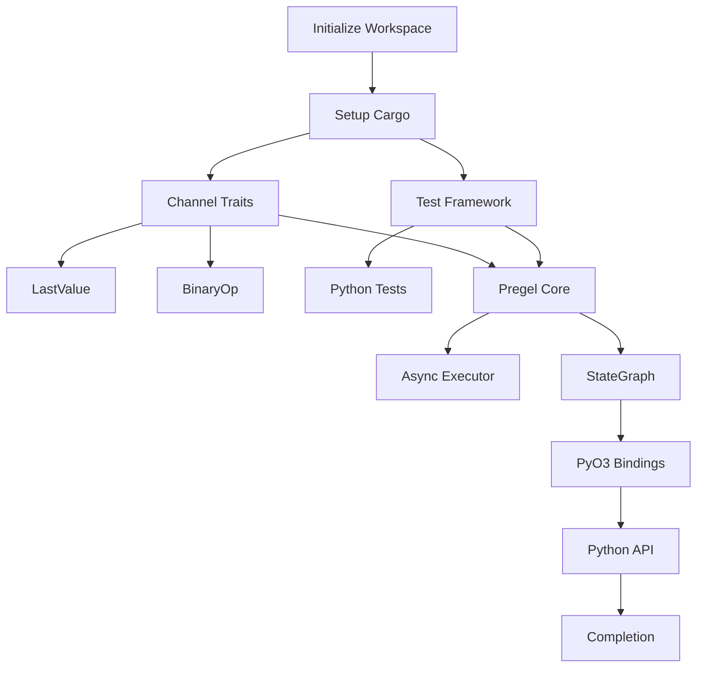

# 🦀 LangGraph Rust Port - Master Task Tracker

## 📊 Project Overview
**Project**: LangGraph Rust Port with Python API Compatibility  
**Duration**: 10 weeks (Phase 1-3) + Ongoing maintenance  
**Methodology**: Traffic-Light Development (RED → YELLOW → GREEN)  
**Target**: 10-100x performance improvement with 100% API compatibility

## 🎯 Project Status Dashboard

### Overall Progress
| Phase | Status | Progress | Completion | Target Date |
|-------|--------|----------|------------|-------------|
| 🔴 RED | **Not Started** | 0/19 tasks | 0% | Week 1-2 |
| 🟡 YELLOW | **Pending** | 0/20 tasks | 0% | Week 3-6 |
| 🟢 GREEN | **Pending** | 0/21 tasks | 0% | Week 7-10 |
| **TOTAL** | **Active** | **0/60 tasks** | **0%** | 10 weeks |

### Critical Path Items (P0)
| Task ID | Description | Status | Blocker |
|---------|-------------|--------|---------|
| 001 | Initialize Workspace | 🔴 Not Started | None |
| 002 | Setup Cargo Workspace | 🔴 Not Started | 001 |
| 003 | Define Channel Traits | 🔴 Not Started | 002 |
| 004 | Create Test Framework | 🔴 Not Started | 002 |
| 020 | Pregel Core Architecture | 🔴 Not Started | 003, 004 |
| 042 | PyO3 Bindings Setup | 🔴 Not Started | 020 |

## 🚦 Traffic-Light Phase Breakdown

### 🔴 RED Phase: Foundation (Week 1-2)
**Goal**: Establish architecture, write failing tests, implement basic channels

| ID | Task | Priority | Hours | Status | Owner | Dependencies |
|----|------|----------|-------|--------|-------|--------------|
| 001 | Initialize Workspace | P0 | 2 | 🔴 Not Started | - | None |
| 002 | Setup Cargo Workspace | P0 | 4 | 🔴 Not Started | - | 001 |
| 003 | Define Channel Traits | P0 | 8 | 🔴 Not Started | - | 002 |
| 004 | Create Test Framework | P0 | 8 | 🔴 Not Started | - | 002 |
| 005 | Implement LastValue Channel | P0 | 6 | 🔴 Not Started | - | 003 |
| 006 | Implement BinaryOperator Channel | P0 | 6 | 🔴 Not Started | - | 003 |
| 007 | Setup CI/CD Pipeline | P1 | 4 | 🔴 Not Started | - | 002 |
| 008 | Create Python Test Harness | P0 | 6 | 🔴 Not Started | - | 004 |
| 009 | Implement Topic Channel | P1 | 6 | 🔴 Not Started | - | 003 |
| 010 | Implement EphemeralValue Channel | P1 | 6 | 🔴 Not Started | - | 003 |
| 011 | Design Error Handling | P0 | 4 | 🔴 Not Started | - | 003 |
| 012 | Create Serialization Framework | P0 | 8 | 🔴 Not Started | - | 003 |
| 013 | Implement AnyValue Channel | P2 | 4 | 🔴 Not Started | - | 003 |
| 014 | Implement UntrackedValue Channel | P2 | 4 | 🔴 Not Started | - | 003 |
| 015 | Setup Benchmark Framework | P1 | 4 | 🔴 Not Started | - | 004 |
| 016 | Create Documentation Structure | P2 | 2 | 🔴 Not Started | - | 001 |
| 017 | Implement NamedBarrierValue Channel | P2 | 6 | 🔴 Not Started | - | 003 |
| 018 | Setup GitHub Actions | P1 | 4 | 🔴 Not Started | - | 007 |
| 019 | Create Integration Test Suite | P0 | 8 | 🔴 Not Started | - | 004, 008 |

**RED Phase Total**: 96 hours (~2.5 weeks at 40 hrs/week)

### 🟡 YELLOW Phase: Implementation (Week 3-6)
**Goal**: Build core Pregel engine, StateGraph API, basic checkpointing

| ID | Task | Priority | Hours | Status | Owner | Dependencies |
|----|------|----------|-------|--------|-------|--------------|
| 020 | Pregel Core Architecture | P0 | 16 | 🔴 Not Started | - | 003, 004 |
| 021 | Async Executor Design | P0 | 12 | 🔴 Not Started | - | 020 |
| 022 | Task Scheduler Implementation | P0 | 12 | 🔴 Not Started | - | 021 |
| 023 | StateGraph Builder API | P0 | 16 | 🔴 Not Started | - | 020 |
| 024 | Graph Compilation Logic | P0 | 12 | 🔴 Not Started | - | 023 |
| 025 | Message Handling System | P0 | 8 | 🔴 Not Started | - | 020 |
| 026 | Checkpoint Base Implementation | P0 | 12 | 🔴 Not Started | - | 012 |
| 027 | SQLite Checkpoint Backend | P1 | 8 | 🔴 Not Started | - | 026 |
| 028 | Node Execution Framework | P0 | 10 | 🔴 Not Started | - | 022 |
| 029 | Edge Routing System | P0 | 8 | 🔴 Not Started | - | 023 |
| 030 | Conditional Edge Logic | P0 | 6 | 🔴 Not Started | - | 029 |
| 031 | Stream Output Implementation | P1 | 8 | 🔴 Not Started | - | 021 |
| 032 | Interrupt Handling | P1 | 10 | 🔴 Not Started | - | 021 |
| 033 | MessageGraph Implementation | P1 | 12 | 🔴 Not Started | - | 023 |
| 034 | Runtime Configuration | P1 | 6 | 🔴 Not Started | - | 020 |
| 035 | Memory Pool Management | P2 | 8 | 🔴 Not Started | - | 020 |
| 036 | Graph Visualization | P3 | 6 | 🔴 Not Started | - | 023 |
| 037 | Debug Tooling | P2 | 8 | 🔴 Not Started | - | 020 |
| 038 | Performance Monitoring | P2 | 6 | 🔴 Not Started | - | 020 |
| 039 | Integration Testing Expansion | P0 | 12 | 🔴 Not Started | - | 023 |

**YELLOW Phase Total**: 192 hours (~4.8 weeks at 40 hrs/week)

### 🟢 GREEN Phase: Production Ready (Week 7-10)
**Goal**: Complete all channels, PyO3 bindings, optimization, documentation

| ID | Task | Priority | Hours | Status | Owner | Dependencies |
|----|------|----------|-------|--------|-------|--------------|
| 040 | Complete All Channels | P0 | 16 | 🔴 Not Started | - | All channel tasks |
| 041 | Error Handling Framework | P0 | 8 | 🔴 Not Started | - | 011 |
| 042 | PyO3 Bindings Setup | P0 | 12 | 🔴 Not Started | - | 023 |
| 043 | Python API Wrapper | P0 | 16 | 🔴 Not Started | - | 042 |
| 044 | Async Python Support | P0 | 12 | 🔴 Not Started | - | 043 |
| 045 | Type Conversion Layer | P0 | 10 | 🔴 Not Started | - | 043 |
| 046 | Performance Optimization | P0 | 16 | 🔴 Not Started | - | 040 |
| 047 | Memory Optimization | P0 | 12 | 🔴 Not Started | - | 046 |
| 048 | Benchmark Suite | P0 | 8 | 🔴 Not Started | - | 015 |
| 049 | Documentation Generation | P1 | 8 | 🔴 Not Started | - | 043 |
| 050 | Example Port | P1 | 12 | 🔴 Not Started | - | 043 |
| 051 | Integration Test Complete | P0 | 16 | 🔴 Not Started | - | 043 |
| 052 | Security Audit | P1 | 8 | 🔴 Not Started | - | 040 |
| 053 | Package Publishing Setup | P1 | 6 | 🔴 Not Started | - | 043 |
| 054 | CI/CD Finalization | P1 | 6 | 🔴 Not Started | - | 051 |
| 055 | Upstream Sync Automation | P0 | 12 | 🔴 Not Started | - | 018 |
| 056 | Performance Validation | P0 | 8 | 🔴 Not Started | - | 048 |
| 057 | API Compatibility Test | P0 | 8 | 🔴 Not Started | - | 051 |
| 058 | Load Testing | P1 | 8 | 🔴 Not Started | - | 048 |
| 059 | Release Preparation | P0 | 6 | 🔴 Not Started | - | All |
| 060 | Project Completion | P0 | 4 | 🔴 Not Started | - | 059 |

**GREEN Phase Total**: 206 hours (~5.2 weeks at 40 hrs/week)

## 🔗 Dependency Graph



## ⚠️ Risk Register

| Risk | Impact | Probability | Mitigation |
|------|--------|-------------|------------|
| Python API changes upstream | High | Medium | Automated sync monitoring |
| Performance target not met | High | Low | Early benchmarking, profiling |
| PyO3 compatibility issues | Medium | Medium | Early prototype testing |
| Async complexity | Medium | Medium | Incremental implementation |
| Test coverage gaps | Medium | Low | Integration-First methodology |

## 📈 Success Metrics

### Phase Gates
- **RED Complete**: All channel traits defined, basic tests passing
- **YELLOW Complete**: Core engine working, StateGraph functional
- **GREEN Complete**: Full API compatibility, 10x performance validated

### Quality Metrics
- [ ] 95% test coverage
- [ ] Zero unsafe code (except FFI)
- [ ] All Python examples working
- [ ] Performance benchmarks passing
- [ ] Documentation complete

## 👥 Resource Allocation

| Role | Allocation | Phase Focus |
|------|------------|-------------|
| Rust Architect | 100% | All phases |
| Python Expert | 50% | RED, GREEN |
| DevOps Engineer | 25% | RED, GREEN |
| Documentation | 25% | GREEN |

## 📅 Timeline

```
Week 1-2:   RED Phase    [##########----------]
Week 3-6:   YELLOW Phase [----##########------]
Week 7-10:  GREEN Phase  [----------##########]
Week 11+:   Maintenance  [--------------------]
```

## 🚀 Next Actions

1. ✅ Create task tracking structure
2. 🔴 Begin Task 001: Initialize Workspace
3. 🔴 Set up development environment
4. 🔴 Clone Python LangGraph for reference

## 📝 Notes

- All tasks follow Traffic-Light Development
- Integration-First testing (no mocks)
- Continuous upstream monitoring
- Performance validation at each phase

---

*Last Updated: 2024-12-15*  
*Version: 1.0.0*  
*Tracking 60 tasks across 3 phases*